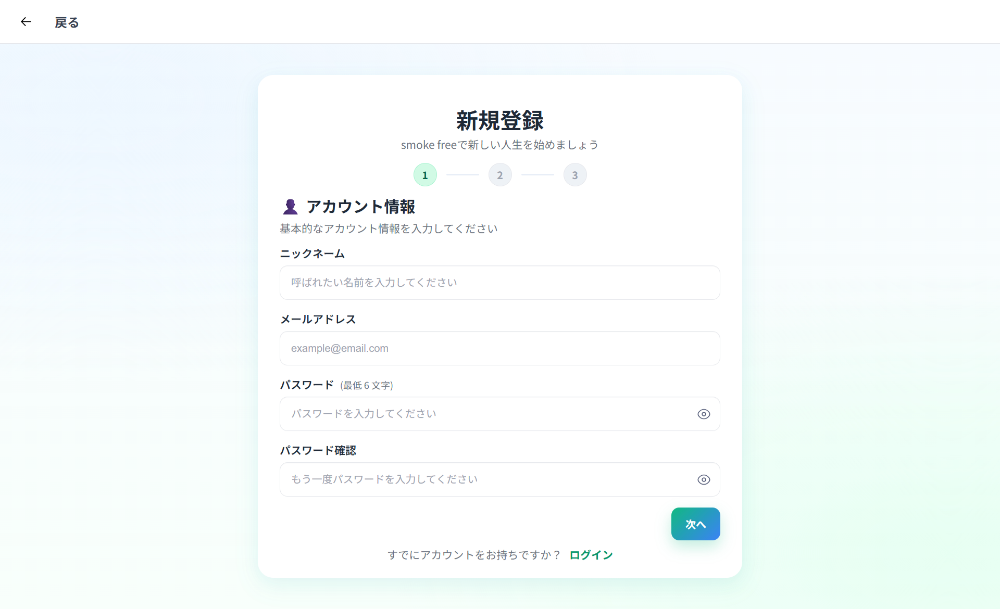
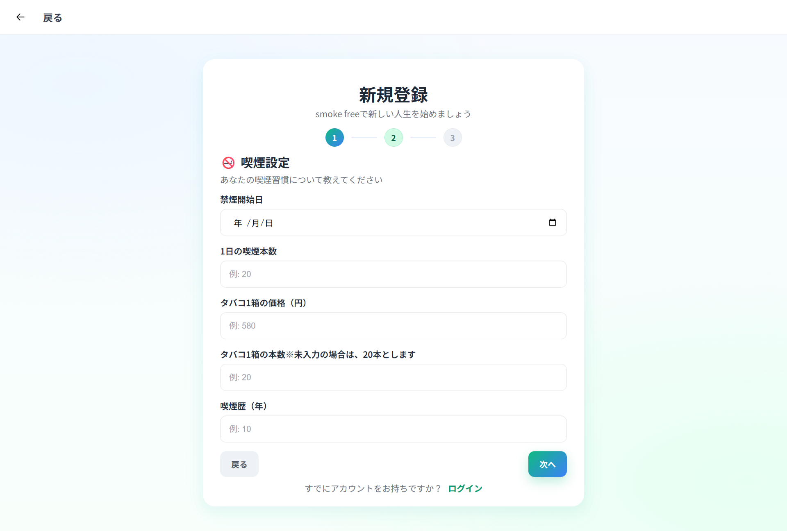
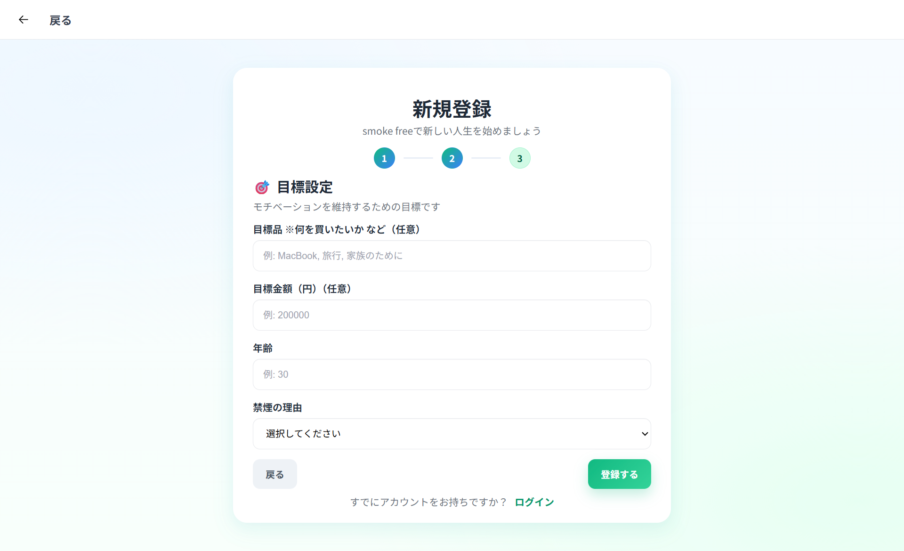
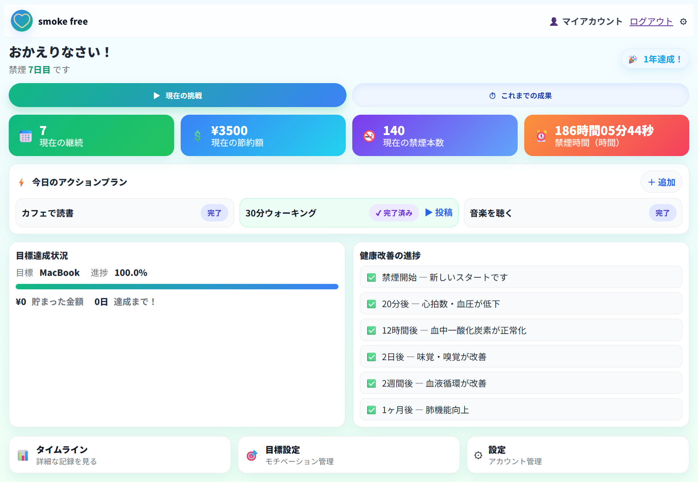
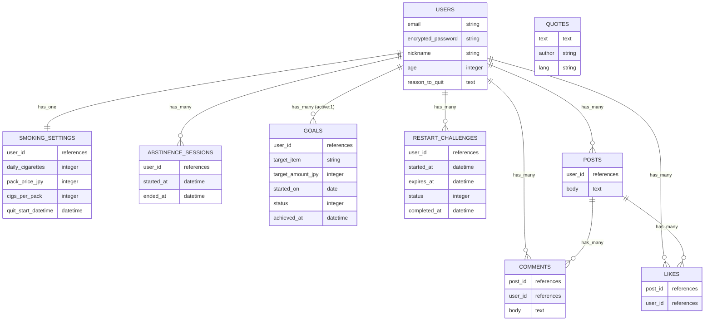
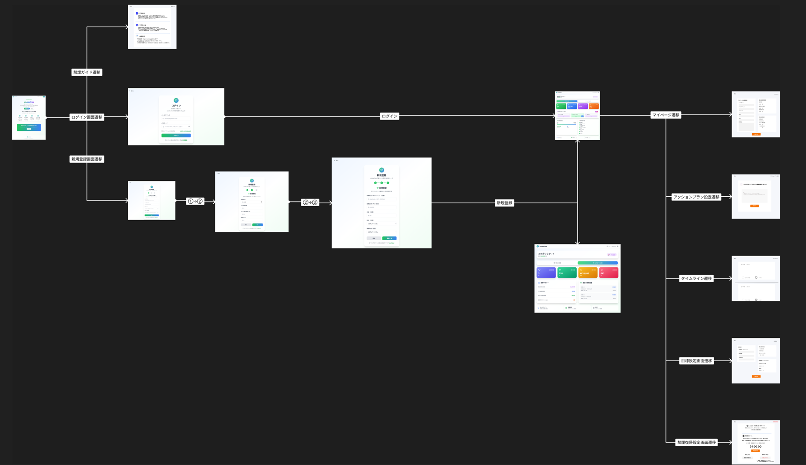

# アプリケーション名
 smoke free

# アプリケーション概要
喫煙者のための長期禁煙支援アプリであり、禁煙本数・節約額・経過時間のリアルタイム／累計可視化、日々のアクションプラン作成とタイムライン共有（いいね・コメント）、欲しい物・金額からの目標逆算、喫煙後24時間禁煙で再開できる再起ルールを備え、禁煙初挑戦者/再挑戦者の長期継続を後押しする。

# URL
https://smoke-free.onrender.com

# テスト用アカウント
・basic認証ID: smoke 
・basic認証パスワード: free81536 
・メールアドレス:test@test.com 
・パスワード：test1234

# 利用方法
## アカウント登録
1 ニックネーム、メールアドレス、パスワード、禁煙開始日（日付選択）、1日の喫煙本数、喫煙歴、年齢、禁煙理由を登録 
2 任意で、目標商品・やりたいこと、目標金額を設定可能
## 現在の禁煙成果のリアルタイム表示
上記のアカウント登録にて必須事項記載後、ダッシュボードに遷移し現在地点での禁煙成果のリアルタイム表示を確認可能

# アプリケーションを作成した背景
近年は世界で健康意識が高まる中、日本では禁煙希望者が約2割にとどまり、加熱式タバコの“低害”認知や価格の痛みの弱さ、職場コミュニケーションなどにより「やめる必要性」が薄れ、挫折経験の蓄積で自己効力感も下がっている。 
これらの課題を解決するために、開発者自身の長期禁煙成功の経験も活かしながら
禁煙初挑戦者・再挑戦者を対象に、 
①紙巻・加熱式を含む完全禁煙の継続 
②ラプス後の早期リカバリーを支援するアプリを開発することにした。 
※ラプス（Lapse）とは 
一時的な喫煙意欲が再発する現象であり、完全再喫煙（Relapse）に至る前段階である。 よくあることが、ラプス後に「自分はダメだ」という【Abstinence Violation Effect（禁欲違反効果）】が生じると、自己非難→投げやり→全面再喫煙に進みやすい。

# 要件定義書

## users
| Column | Type | Options |
|---|---|---|
| email | string | null: false, unique: true, index: true |
| encrypted_password | string | null: false |
| nickname | string | null: false |
| age | integer | null: false |
| reason_to_quit | integer | null: false |

**Associations**  
- has_one :smoking_setting, dependent: :destroy  
- has_many :abstinence_sessions, dependent: :destroy  
- has_one :goal, -> { where(status: 0) }, class_name: "Goal"  
- has_many :restart_challenges, dependent: :destroy  
- has_many :posts, dependent: :destroy  
- has_many :comments, dependent: :destroy  
- has_many :likes, dependent: :destroy  
- has_many :liked_posts, through: :likes, source: :post  
---

## smoking_settings
| Column | Type | Options |
|---|---|---|
| user | references | null: false, unique: true, index: true, foreign_key: true |
| daily_cigarettes | integer | null: false |
| pack_price_jpy | integer | null: false |
| cigs_per_pack | integer | null: false |
| quit_start_datetime | datetime | null: false|

**Associations**  
- belongs_to :user  

---

## abstinence_sessions
| Column | Type | Options |
|---|---|---|
| user | references | null: false, index: true, foreign_key: true |
| started_at | datetime | null: false |
| ended_at | datetime | null: true |

**Indexes**  
- index: [:user, :started_at]

**Associations**  
- belongs_to :user  

---

## goals
| Column | Type | Options |
|---|---|---|
| user | references | null: false, index: true, foreign_key: true |
| target_item | string | null: false |
| target_amount_jpy | integer | null: false |
| started_on | date | null: false |
| status | integer | null: false, default: 0, comment: "0=active,1=achieved" |
| achieved_at | datetime | null: true |

**Associations**  
- belongs_to :user  

---

## restart_challenges
| Column | Type | Options |
|---|---|---|
| user | references | null: false, index: true, foreign_key: true |
| started_at | datetime | null: false |
| expires_at | datetime | null: false |
| status | integer | null: false, default: 0, comment: "0=pending,1=success,2=failed,3=cancelled" |
| completed_at | datetime | null: true |

**Indexes**  
- index: [:user, :started_at]

**Associations**  
- belongs_to :user  

---

## quotes
| Column | Type | Options |
|---|---|---|
| text | text | null: false |
| author | string | null: true |
| lang | string | null: false, default: "ja" |

---

## posts
| Column | Type | Options |
|---|---|---|
| user | references | null: false, index: true, foreign_key: true |
| body | text | null: false |

**Associations**  
- belongs_to :user  
- has_many :comments, dependent: :destroy  
- has_many :likes, dependent: :destroy  
- has_many :liked_users, through: :likes, source: :user  

---

## comments
| Column | Type | Options |
|---|---|---|
| post | references | null: false, index: true, foreign_key: true |
| user | references | null: false, index: true, foreign_key: true |
| body | text | null: false |

**Associations**  
- belongs_to :post  
- belongs_to :user  

---

## likes
| Column | Type | Options |
|---|---|---|
| post | references | null: false, index: true, foreign_key: true |
| user | references | null: false, index: true, foreign_key: true |

**Indexes / Constraints**  
- unique: [:post, :user]

**Associations**  
- belongs_to :post  
- belongs_to :user  

---

# 実装した機能についての画像やGIFおよびその説明
## アカウント登録機能

一つの画面で項目ごとに入力できるよう設計
## 現在の禁煙成果のリアルタイム表示機能

例: 
ユーザー名:bbb 
タバコ一箱の値段:500円 
一箱の本数:20本 
一日の喫煙本数:20本 
禁煙開始日:2025/10/30 

禁煙時間を秒までリアルタイムで表示するよう設計

# 実装予定の機能
現在、アクションプラン設定を実装中
今後は、
・タイムライン機能（一覧・投稿・削除・コメント・いいね） 
・目標設定機能
・マイページ機能
・条件付き禁煙復帰機能
・今までの禁煙履歴合計成果の表示機能 などを実装予定

# データベース設計図

# 画面遷移図

# 開発環境
・フロントエンド: HTML/CSS/JavaScript 
・バックエンド: Ruby on Rails/Ruby 
・インフラ：MySQL/PostgreSQL 
・テスト: Rspec 
・テキストエディタ: VS Code 
・タスク管理: GitHub Projects 
# ローカルでの動作方法
git clone https://github.com/ryuta-takayama/smoke-free.git 
cd smoke-free 
bundle install 
rails db:create 
rails db:migrate 
rails s
# 工夫したポイント
## アカウント登録機能
1 javascriptを使って記入が多いところを3ステップに分けてアカウント登録できるようにすることで、登録負荷をあまりかけないよう工夫 
2 Toggleを使ってパスワードを一時的に可視化し、確認用も含め一致をスムーズに行えるよう工夫

