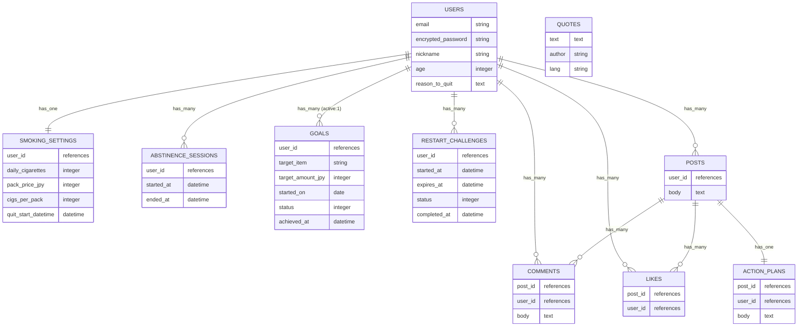

# Database Design

## users
| Column | Type | Options |
|---|---|---|
| email | string | null: false, unique: true, index: true |
| encrypted_password | string | null: false |
| nickname | string | null: false |
| age | integer | null: false |
| reason_to_quit | integer | null: false |

**Associations**  
- has_one :smoking_setting, dependent: :destroy  
- has_many :abstinence_sessions, dependent: :destroy  
- has_one :goal, -> { where(status: 0) }, class_name: "Goal"  
- has_many :restart_challenges, dependent: :destroy  
- has_many :posts, dependent: :destroy  
- has_many :comments, dependent: :destroy  
- has_many :likes, dependent: :destroy  
- has_many :liked_posts, through: :likes, source: :post  

---

## smoking_settings
| Column | Type | Options |
|---|---|---|
| user | references | null: false, unique: true, index: true, foreign_key: true |
| daily_cigarettes | integer | null: false |
| pack_price_jpy | integer | null: false |
| cigs_per_pack | integer | null: false |
| quit_start_datetime | datetime | null: false|

**Associations**  
- belongs_to :user  

---

## abstinence_sessions
| Column | Type | Options |
|---|---|---|
| user | references | null: false, index: true, foreign_key: true |
| started_at | datetime | null: false |
| ended_at | datetime | null: true |

**Indexes**  
- index: [:user, :started_at]

**Associations**  
- belongs_to :user  

---

## goals
| Column | Type | Options |
|---|---|---|
| user | references | null: false, index: true, foreign_key: true |
| target_item | string | null: false |
| target_amount_jpy | integer | null: false |
| started_on | date | null: false |
| status | integer | null: false, default: 0, comment: "0=active,1=achieved" |
| achieved_at | datetime | null: true |

**Associations**  
- belongs_to :user  

---

## restart_challenges
| Column | Type | Options |
|---|---|---|
| user | references | null: false, index: true, foreign_key: true |
| started_at | datetime | null: false |
| expires_at | datetime | null: false |
| status | integer | null: false, default: 0, comment: "0=pending,1=success,2=failed,3=cancelled" |
| completed_at | datetime | null: true |

**Indexes**  
- index: [:user, :started_at]

**Associations**  
- belongs_to :user  

---

## quotes
| Column | Type | Options |
|---|---|---|
| text | text | null: false |
| author | string | null: true |
| lang | string | null: false, default: "ja" |

---

## posts
| Column | Type | Options |
|---|---|---|
| user | references | null: false, index: true, foreign_key: true |
| body | text | null: false |

**Associations**  
- belongs_to :user  
- has_one :action_plan, dependent: :destroy  
- has_many :comments, dependent: :destroy  
- has_many :likes, dependent: :destroy  
- has_many :liked_users, through: :likes, source: :user  

---

## action_plans
| Column | Type | Options |
|---|---|---|
| post | references | null: false, index: true, foreign_key: true |
| user | references | null: false, index: true, foreign_key: true |
| body | text | null: false |

**Associations**  
- belongs_to :post  
- belongs_to :user  

---

## comments
| Column | Type | Options |
|---|---|---|
| post | references | null: false, index: true, foreign_key: true |
| user | references | null: false, index: true, foreign_key: true |
| body | text | null: false |

**Associations**  
- belongs_to :post  
- belongs_to :user  

---

## likes
| Column | Type | Options |
|---|---|---|
| post | references | null: false, index: true, foreign_key: true |
| user | references | null: false, index: true, foreign_key: true |

**Indexes / Constraints**  
- unique: [:post, :user]

**Associations**  
- belongs_to :post  
- belongs_to :user  

---

## 🔗 ER Overview
- **User** — 1:1 → **SmokingSetting**, **Goal**  
- **User** — 1:N → **AbstinenceSession**, **RestartChallenge**, **Post**, **Comment**, **Like**  
- **Post** — 1:1 → **ActionPlan**  
- **Post** — 1:N → **Comment**, **Like**  
- **User ↔ Post** — N:N via **Like**  
- **Quotes** — 固定テーブル（外部キー関係なし）  

